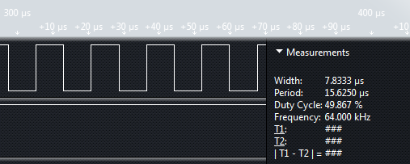
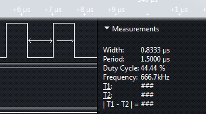
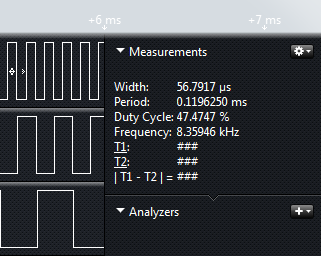

### Contents
* [Why use DirectIO?](#user-content-why-use-directio)
* [Comparison](#user-content-comparison)
* [Performance](#user-content-performance)
* [API](#user-content-api)
  * [Include Files](#user-content-include-files)
  * [For Arduino IDE 1.0 Users](#user-content-for-arduino-ide-10-users)
  * [Input](#user-content-input)
  * [Output](#user-content-output)
  * [Multi-Bit I/O](#user-content-multi-bit-io)
    * [InputPort](#user-content-inputport)
    * [OutputPort](#user-content-outputport)
  * [Active Low Signals](#user-content-active-low-signals)
    * [InputLow](#user-content-inputlow)
    * [OutputLow](#user-content-outputlow)
  * [Pin Numbers Determined at Runtime](#user-content-pin-numbers-determined-at-runtime)
    * [InputPin](#user-content-inputpin)
    * [OutputPin](#user-content-outputpin)
* [Benchmarks](#user-content-benchmarks)
  * [Arduino I/O](#user-content-arduino-io)
  * [Direct I/O](#user-content-direct-io)
  * [Direct I/O with Dynamic Pin Numbers](#user-content-direct-io-with-dynamic-pin-numbers)
  * [8-Bit Port using Arduino I/O](#user-content-8-bit-port-using-arduino-io)
  * [8-Bit Port using DirectIO](#user-content-8-bit-port-using-directio)

### Why use DirectIO?
Two reasons: 
* Speed: writes are 40x to 60x faster than the Arduino libraries. Maximum output frequency is 2.66 MHz, vs 64 KHz for the Arduino libraries. When reading or writing multiple I/O together, even greater performance gains are possible.
* Simple API: just create pin objects. Assigning to a pin performs a write, using its value performs a read.

### Comparison
The standard Arduino I/O library (Wiring) isn't particularly fast. There are several contributing issues, but they primarily stem from pin numbers being specified at runtime. This can be useful, but for the most part, pin numbers are known at compile time. Key differences between native Arduino I/O and DirectIO include:

| Arduino I/O                |   DirectIO
|----------------------------|------------
| Pin numbers are checked for validity at runtime, on every I/O operation. | Validity checked at compile time, based on the target board selected in the Arduino IDE.
| I/O port address and bit mask are read from program memory on every I/O operation | Port and bit mask are determined at compile time, based on the target board.
| Since port addresses are loaded dynamically, indirect load instructions must be used. | Fast I/O instructions (`sbi` and `cbi`) are used by the compiler.
| Because of indirect addressing, digitalWrite must use a multi-instruction read/modify/write sequence. Since this is not atomic, digitalWrite must turn off interrupts and save/restore the status register. | `sbi` and `cbi` instructions execute atomically, so writes don't need to disable interrupts.
| digitalRead and digitalWrite check/disable PWM on the pin, on every I/O operation. | PWM on the pin is disabled at initialization time.

### Performance

|                      | Arduino I/O                |   DirectIO                |
| ---------------------|----------------------------|---------------------------|
| Init Code Size       | 6 bytes per I/O            | 12 bytes per I/O          |
| Input Code Size      | 6 bytes per read           | 2 bytes per read          |
| Output Code Size     | 6 bytes per write          | 2 bytes to write a constant<br>10 bytes to write a variable value |
| Time to Write Output | >120 cycles                | 2 cycles to write a constant<br>6 to 8 cycles to write a variable value |
| Max Output Frequency | 64 KHz                     | 2.66 MHz                  |
| RAM usage            | none                       | none                      |

### API

#### Include Files
When you add the DirectIO library to your project, the Arduino IDE will add all of the include files:
```C++
#include <base.h>
#include <DirectIO.h>
#include <ports.h>
```
Remove `base.h` and `ports.h`, and just include `DirectIO.h`.

#### For Arduino IDE 1.0 Users
In order to map the pin numbers you specify into AVR ports, you need to tell the Direct IO library which Arduino board type you are using. If you are using Arduino IDE v1.5 or higher, the IDE will do this automatically based on the board selected in the Board menu. If you are using IDE 1.0, you will need to define which board you are using. For example, if you have an Uno board:
```C++
#define ARDUINO_AVR_UNO 1
#include <DirectIO.h>
```

If you omit this step, you will see a warning during compilation, and a standard Arduino board will be assumed:
``` 
error: #warning "Unsupported Arduino variant. If you are using Arduino IDE 1.0, be sure to #define an Arduino variant (e.g. #define ARDUINO_AVR_UNO 1). See ports.h."
```

There are three supported Arduino variants:
* Standard board variants:
```
	ARDUINO_AVR_UNO
	ARDUINO_AVR_YUN
	ARDUINO_AVR_DUEMILANOVE
	ARDUINO_AVR_NANO
	ARDUINO_AVR_MINI
	ARDUINO_AVR_ETHERNET
	ARDUINO_AVR_FIO
	ARDUINO_AVR_BT
	ARDUINO_AVR_LILYPAD
	ARDUINO_AVR_PRO
	ARDUINO_AVR_NG
```

* Mega board variants:
```
	ARDUINO_AVR_MEGA2560
	ARDUINO_AVR_ADK
```

* Leonardo board variants:
```
	ARDUINO_AVR_LEONARDO
	ARDUINO_AVR_MICRO
	ARDUINO_AVR_ESPLORA
	ARDUINO_AVR_LILYPAD_USB
	ARDUINO_AVR_ROBOT_MOTOR
	ARDUINO_AVR_ROBOT_CONTROL
```

*Note, the Arduino Due (ARM platform) isn't supported yet.*

#### Input

Input is a class template; the template parameter is simply the pin number. You must specify a number that is known at compile time - a literal number, a number specified via `const u8 my_pin = ...`, or via `#define my_pin ...`.

```C++
template <u8 pin> class Input { ... };
```

For example, to create an input on pin 3 and read its value into a variable:

```C++
Input<3> my_input;
boolean value = my_input;           // implicit call to read()
boolean value2 = my_input.read();   // or use an explicit call, if you prefer
```

The Input constructor accepts an optional argument `pullup` specifying whether the port pullup resistors should be enabled.
```C++
Input<3> my_input(false);       // disable internal pullup on this input
```

#### Output

Simiar to Input, Output is a class template that requires a pin number to be specified.

```C++
template <u8 pin> class Output { ... };
```

For example, to create an output on pin 2 and turn it on:

```C++
Output<2> my_output;
my_output = HIGH;           	// implicit call to write()
my_output.write(HIGH);      	// or use an explicit call, if you prefer
```

The Output constructor accepts an optional argument `initial_value` specifying the initial state of the output (HIGH or LOW).

```C++
Output<2> my_output(HIGH);   	// output should be initially set to HIGH
```

You can also read the current state of an output - no need to keep a separate state variable. Note that this reads back the value from the I/O port; no additional memory is used.

```C++
my_output = ! my_output;		// toggle the output
my_output = ! my_output.read();	// this works too, if you like explicit calls
my_output.toggle();				// or use the nice method provided
```

To emit a pulse of minimum duration (2 cycles, or 125 ns on a 16 Mhz board):

```C++
my_output.pulse(HIGH);			// set the output HIGH then LOW
```

or

```C++
my_output.pulse(LOW);			// set the output LOW then HIGH
```

#### Multi-Bit I/O

The Arduino standard library works hard to hide the implementation details of digital I/O, and presents a nicer API based on pin numbers. But there are advantages to breaking this model:
* Speed: you can read or write up to 8 pins with a single instruction.
* Simultaneity: all 8 pins are read or written simultaneously.

The DirectIO library provides two classes (`InputPort` and `OutputPort`) that allow port-based I/O, mapping up to 8 bits to a single port object.

1. Determine how many pins you need.
2. Look at the pinout for your Arduino variant, and identify a set of pins that share a common port and are sequentially numbered in that port. Or, look at the pin definitions in `ports.h`.
3. Wire your project using those pins.
4. Define an `InputPort` or `OutputPort` object mapped to the selected port and pins. For example, support you are using a 4-bit port and have decided to use Port C2-C5 (in a standard Arduino sketch, these would be referred to as pins 16-19):

```C++
// Define a 4-bit port starting at port C2.
// This will control C2, C3, C4, C5 (pins 16-19).
OutputPort<PORT_C, 2, 4> my_port;

// Turn on C2 (pin 16), and turn off the rest.
my_port = 0x01;
```


##### InputPort

InputPort is a class template that takes 3 parameters:
* The port, as defined in `ports.h`. For example, `PORT_D`. Standard Arduinos use `PORT_D`, `PORT_B`, and `PORT_C`. Arduino Mega boards have ports up through `PORT_L`.
* The starting pin number in the port (default 0)
* The number of pins (default 8).

```
template <class port, u8 start_bit=0, u8 nbits=8> class InputPort { ... }
```

Like Input objects, InputPorts support reading values implicitly or explicitly:
```
InputPort<PORT_C, 2, 4> my_port;
u8 value = my_port;           	// implicit call to read()
u8 value2 = my_port.read();   	// or use an explicit call, if you prefer
```

For ports less than 8 bits wide, read() places the bits read from the port into the *n* low order bits of the returned value.

##### OutputPort

OutputPort is a class template. The parameters are the same as `InputPort`.

```
template <class port, u8 start_bit=0, u8 nbits=8> class OutputPort { ... }
```

Like Output objects, OutputPorts support writing values implicitly or explicitly:
```
OutputPort<PORT_C, 2, 4> my_port;
my_output = 0x07;           	// implicit call to write()
my_output.write(0x07);      	// or use an explicit call, if you prefer
```

For ports less than 8 bits wide, read() places the bits read from the port into the *n* low order bits of the returned value.

#### Active Low Signals

In some circuits, the meaning of inputs is reversed - for example, a switch input may be LOW when the switch is closed. This is an *active low* input. It can be helpful in program logic to consider LOW as true and HIGH as false. There are two classes that support active low signals.

##### InputLow

Define an active low input on pin 3 and read its value:

```C++
InputLow<3> switch;

if(switch) {
	// this code will execute when the switch is closed,
	// and the input voltage is low.
}
else {
	// this code will execute when the switch is open,
	// and the input voltage is high.
}
```


##### OutputLow

Suppose we have the cathode of an LED connected to pin 2 (the anode would be connected to +5V through a current limiting resistor). We can define an active low output on pin 2 to control it:

```C++
OutputLow<2> led;
led = true;				// turns on the LED by putting low voltage on pin 2
```

We could do the same thing with a normal Output if we didn't mind the backward logic:

```C++
Output<2> led;
led = false;			// turns on the LED by putting low voltage on pin 2
```

#### Pin Numbers Determined at Runtime

Like the easy to use syntax for reading and writing values, but have a case where you really don't know the pin number at compile time? For example, you might define a multi-pin output port and loop over a range of pin numbers writing values to each one. There are two classes that support this:

##### InputPin

```C++
boolean DoSomething(u8 pin)
{
	InputPin(pin) my_input;		// note pin number is now a constructor parameter
	return my_input;
}
```

`InputPin` looks up and caches the port address and bit mask (using 3 bytes of RAM per instance), in order to boost performance over digitalRead.

##### OutputPin

```C++
void DoSomething(u8 pin)
{
	OutputPin(pin) my_output;	// note pin number is now a constructor parameter
	my_output = HIGH;
}
```

`OutputPin` looks up and caches the port address and bit mask (using 8 bytes of RAM per instance), in order to gain a 3x speedup over digitalWrite.

### Benchmarks
#### Arduino I/O

Here's a short sketch that drives an output pin as fast as possible:  
  
```C++
#define PIN 2  

void setup() {  
    pinMode(PIN, OUTPUT);  
}  

void loop() {  
  while(1) {  
    digitalWrite(PIN, HIGH);  
    digitalWrite(PIN, LOW);  
  }  
}  
```

This generates the following code:  
```
00000234 <setup>:  
 234:   61 e0           ldi r22, 0x01   ; 1  
 236:   82 e0           ldi r24, 0x02   ; 2  
 238:   5a c0           rjmp    .+180       ; 0x2ee <pinMode>  
```

In this loop, each write to the output requires 3 instructions to set up a call to `digitalWrite`. 
  
```
0000023a <loop>:
 23a:   61 e0           ldi r22, 0x01   ; 1
 23c:   82 e0           ldi r24, 0x02   ; 2
 23e:   90 d0           rcall   .+288       ; 0x360 <digitalWrite>
 
 240:   60 e0           ldi r22, 0x00   ; 0
 242:   82 e0           ldi r24, 0x02   ; 2
 244:   8d d0           rcall   .+282       ; 0x360 <digitalWrite>
 
 246:   f9 cf           rjmp    .-14        ; 0x23a <loop>
```

Each pass through the loop takes 250 cycles. On a 16 Mhz board, this gives an output frequency of 64 KHz.



#### Direct I/O

Here's the same loop, using the DirectIO library:

```C++
#include <DirectIO.h>  

Output<2> pin;  

void setup() {}  

void loop() {  
  while(1) {  
    pin = HIGH;  
    pin = LOW;  
  }  
}  
```

setup() is now empty, and the initialization is done in the constructor of the global variable 'pin':
```
00000254 <setup>:
 254:   08 95           ret

0000025c <_GLOBAL__sub_I_pin>:
 25c:   61 e0           ldi r22, 0x01   ; 1
 25e:   82 e0           ldi r24, 0x02   ; 2
 260:   56 d0           rcall   .+172       ; 0x30e <pinMode>
 
 262:   60 e0           ldi r22, 0x00   ; 0
 264:   82 e0           ldi r24, 0x02   ; 2
 266:   8c c0           rjmp    .+280       ; 0x380 <digitalWrite>
```

In the new loop, each write to the output is a single instruction. This is what makes the DirectIO library so fast.

```
00000256 <loop>:
 256:   74 9a           sbi 0x0e, 4 ; 14
 258:   74 98           cbi 0x0e, 4 ; 14
 25a:   fd cf           rjmp    .-6         ; 0x256 <loop>
```

Each pass through the loop takes 6 cycles; on a 16 Mhz board, this
gives an output frequency of 2.66 MHz - over 40x faster than the native
Arduino I/O.


#### Direct I/O with Dynamic Pin Numbers

One more example, using pin numbers specified at runtime. Note that you should only do this if you need dynamic pin numbering; if you have constant pin numbers, use the `Output` class described above.

```C++
#include <DirectIO.h>  

OutputPin pin(2);  

void setup() {}  

void loop() {  
  while(1) {  
    pin = HIGH;  
    pin = LOW;  
  }  
}  
```

Each pass through the loop takes 75 cycles; on a 16 Mhz board, this
gives an output frequency of 214 KHz - over 3x faster than the native
Arduino I/O.



#### 8-Bit Port using Arduino I/O

Here is an example sketch that writes a series of values to an 8-bit output port (on pins 0-7).

```C++
#define FIRST_PIN 0

void setup() 
{
  for(u8 i = 0; i < 8; i++) {
   pinMode(FIRST_PIN + i, OUTPUT);
  }
}

void loop() {
  u8 value = 0;
  
  while(1) {
    for(u8 i = 0; i < 8; i++) {
     digitalWrite(FIRST_PIN + 7 - i, bitRead(value, i));
    }
    value++;
  }
}
```

The low order bit is cycling at 8.36 KHz, so the loop is running at 16.7 KHz. This is due to the large number of calls to `digitalWrite`.



#### 8-Bit Port using DirectIO

Here is the same example using DirectIO:
```C++
#include <DirectIO.h>

OutputPort<PORT_D> port;

void setup() {}

void loop() {
  u8 i = 0;
  
  while(1) {
    port = i++;
  }
}
```

First, the code is more readable. Second, it runs faster. A *lot* faster.


The low order bit is cycling at 2 MHz, so the loop is executing at 4MHz. This is over 200x as fast as the native Arduino version. Looking at the disassembly reveals why:
```
0000012c <loop>:
 12c:	80 e0       	ldi	r24, 0x00	; 0
 12e:	8b b9       	out	0x0b, r24	; 11
 130:	8f 5f       	subi	r24, 0xFF	; 255
 132:	fd cf       	rjmp	.-6      	; 0x12e <loop+0x2>
```

It's a 3-instruction loop that takes 4 cycles per iteration. Most of that time is spent incrementing the counter and branching back to the top of the loop. Writing all 8 bits to the port is done by the `out` instruction and takes a single cycle.

